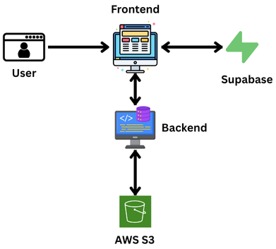

# DocuMentor AI

An intelligent document analysis system that uses Google's Gemini models and a RAG (Retrieval-Augmented Generation) pipeline to answer questions about your documents, complete with secure user authentication and persistent, user-specific storage.

**Live Application:** [**documentor-ai.streamlit.app**](https://documentor-ai.streamlit.app/)

---

## Features

* **Secure User Authentication**: Robust login, registration, and password reset functionality powered by Supabase.
* **Persistent, User-Specific Storage**: Each user's documents, chat history, and vector indexes are stored securely and separately in an AWS S3 bucket.
* **Full Document Management**: Users can upload multiple PDFs and delete them from their account.
* **Persistent Chat History**: Conversations are saved and automatically loaded when a user logs back in, with the option to clear the history and start fresh.
* **Cloud-Powered LLM**: Leverages the powerful Google Gemini family of models for state-of-the-art responses.
* **RAG Pipeline**: Efficient document retrieval using FAISS for context-aware answers.
* **Decoupled Architecture**: A scalable design with a Streamlit frontend and a FastAPI backend.
* **Fully Cloud-Hosted**: Production-ready architecture with the backend on Railway, the frontend on Streamlit Community Cloud, and authentication managed by Supabase.

## Cloud Architecture

The application is architected to run entirely on cloud services. The frontend and backend are decoupled services that communicate over a secure, token-based API.

  

### How It Works

1.  **Frontend (Streamlit)**: The user interacts with the Streamlit web application.
2.  **Authentication (Supabase)**: The user signs up, logs in, or resets their password. Upon success, Supabase provides a secure JWT (JSON Web Token) to the frontend.
3.  **API Requests**: For every action (like uploading a document or asking a question), the frontend sends a request to the backend, including the JWT in the authorization header.
4.  **Backend (FastAPI on Railway)**: The backend uses a secret key to verify that the JWT is valid and extracts the user's unique ID. This protects all API endpoints.
5.  **Document Processing & Storage (S3)**: The backend processes uploaded PDFs, creates vector embeddings, and stores the original file, the chat history, and the FAISS index in a user-specific folder within an AWS S3 bucket.
6.  **RAG Pipeline**: When a user asks a question, the backend retrieves their specific FAISS index from S3, finds the most relevant text chunks, and combines them with the user's query.
7.  **LLM (Google Gemini API)**: This combined prompt is sent to the Google Gemini API to generate a context-aware answer, which is then sent back to the frontend to be displayed.

## Technical Details

* **Authentication**: Supabase
* **Language Model**: Google Gemini API (2.5 Pro & Flash models)
* **Embeddings**: `all-MiniLM-L6-v2`
* **Vector Store**: FAISS
* **Backend**: FastAPI with Uvicorn
* **Frontend**: Streamlit
* **Deployment**: Railway (Backend), Streamlit Community Cloud (Frontend), AWS (S3 Storage)
