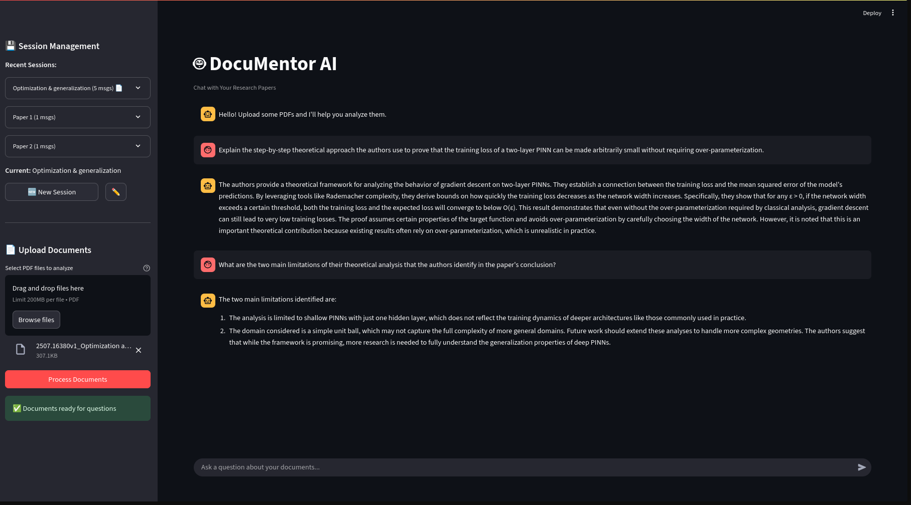

# DocuMentor AI

An intelligent document analysis system that combines fine-tuned language models with RAG (Retrieval-Augmented Generation) to answer questions about research papers.

## Features

- **Fine-tuned LLM**: Qwen2.5-3B-Instruct optimized for document Q&A
- **RAG Pipeline**: Efficient document retrieval and context-aware responses
- **Web Interface**: Clean Streamlit frontend for document upload and chat
- **Dockerized**: Production-ready containerized deployment
- **GPU Optimized**: Memory-efficient inference with 4-bit quantization

## Interface



*Clean, intuitive interface for document upload and intelligent Q&A*

## Architecture

```
┌─────────────────┐    ┌──────────────────┐    ┌─────────────────┐
│   Frontend      │────│    Backend       │────│   ML Pipeline   │
│   (Streamlit)   │    │   (FastAPI)      │    │   (Qwen2.5-3B)  │
└─────────────────┘    └──────────────────┘    └─────────────────┘
                              │
                       ┌──────────────────┐
                       │  Vector Store    │
                       │    (FAISS)       │
                       └──────────────────┘
```

## Setup

### Install Prerequisites

#### NVIDIA Container Toolkit (for Docker GPU support)
```bash
# Ubuntu/Debian
curl -fsSL https://nvidia.github.io/libnvidia-container/gpgkey | sudo gpg --dearmor -o /usr/share/keyrings/nvidia-container-toolkit-keyring.gpg
curl -s -L https://nvidia.github.io/libnvidia-container/stable/deb/nvidia-container-toolkit.list | \
  sed 's#deb https://#deb [signed-by=/usr/share/keyrings/nvidia-container-toolkit-keyring.gpg] https://#g' | \
  sudo tee /etc/apt/sources.list.d/nvidia-container-toolkit.list
sudo apt-get update && sudo apt-get install -y nvidia-container-toolkit
sudo systemctl restart docker
```

> For other operating systems, see the [official NVIDIA documentation](https://docs.nvidia.com/datacenter/cloud-native/container-toolkit/latest/install-guide.html)

#### Git LFS (for model files)
```bash
# Ubuntu/Debian
sudo apt install git-lfs

# macOS
brew install git-lfs

# Initialize in your repo
git lfs install
```

## Quick Start

### Using Docker (Linux/WSL2)

```bash
# Clone the repository
git clone https://github.com/QuelloKun/DocuMentor-AI.git
cd DocuMentor-AI

# Pull LFS files (model weights)
git lfs pull

# Start the services
docker-compose up -d

# Access the application
open http://localhost:8501
```

> **Note for macOS users**: Docker GPU support is not available on macOS. Please use the local development setup below instead.

### Local Development

```bash
# Install dependencies
pip install -r requirements.txt

# Start backend
uvicorn backend:app --host 0.0.0.0 --port 8000

# Start frontend (in another terminal)
streamlit run app.py
```

## Usage

1. **Upload Documents**: Use the sidebar to upload PDF files
2. **Process**: Click "Process Documents" to analyze your files
3. **Ask Questions**: Use the chat interface to query your documents
4. **Get Answers**: Receive contextual responses based on document content

## Project Structure

```
DocuMentor-AI/
├── app.py                 # Streamlit frontend
├── backend.py             # FastAPI backend
├── rag_pipeline.py        # RAG implementation
├── requirements.txt       # Python dependencies
├── docker-compose.yml     # Multi-service orchestration
├── Dockerfile.frontend    # Frontend container
├── Dockerfile.backend     # Backend container
├── models/                # Fine-tuned model weights
└── assets/                # UI screenshots and media
```

## Technical Details

- **Base Model**: Qwen2.5-3B-Instruct with QLoRA fine-tuning
- **Embeddings**: all-MiniLM-L6-v2 for document vectorization
- **Vector Store**: FAISS for efficient similarity search
- **Text Processing**: LangChain for document splitting and RAG
- **Deployment**: Docker with NVIDIA GPU support

## Model Performance

The fine-tuned model achieves strong performance on technical Q&A:
- Specialized for research paper content
- Memory-efficient 4-bit quantization
- Sub-second inference on modern GPUs

## Prerequisites

### For Docker Deployment (Linux/WSL2 only)
- **Linux** or **Windows with WSL2** (macOS not supported for GPU Docker)
- **Docker** and **Docker Compose**
- **NVIDIA Container Toolkit** (for GPU support)
- **NVIDIA GPU** with 8GB+ VRAM and CUDA support
- **Git** with **Git LFS** (for model files)

### For Local Development
- **Python** 3.11+
- **NVIDIA GPU** with 8GB+ VRAM and CUDA drivers
- **Git** with **Git LFS**

## Development

### API Documentation

With the backend running, visit `http://localhost:8000/docs` for interactive API documentation.

## License

This project uses open-source components under permissive licenses. See individual package licenses for details. 
